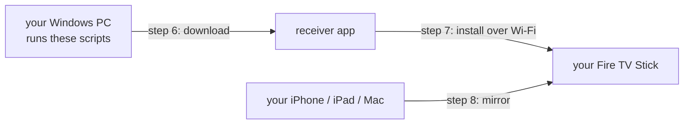

# firetv-airplay-toolkit

**Get working AirPlay on your Fire TV Stick. Follow the steps below.**

[](https://github.com/MrkrampfKampf/firetv-airplay-toolkit/actions/workflows/lint.yml)
[](LICENSE)
[](#what-you-need-before-you-start)
[](https://github.com/jqssun/android-airplay-server)

Mirror your iPhone, iPad or Mac screen to a Fire TV Stick. Video and audio
included. No Apple TV, no paid app, no subscription.

Fire TV has no AirPlay support of its own. This walkthrough puts an open-source
AirPlay 2 receiver on your stick and takes about ten minutes.

> [!IMPORTANT]
> **This repository is the installer, not the receiver.** The app doing the actual
> AirPlay work is [jqssun/android-airplay-server](https://github.com/jqssun/android-airplay-server),
> which builds on [UxPlay](https://github.com/FDH2/UxPlay). Both are GPL-3.0 and
> written by other people. This repository contributes the Windows scripts, the
> device research and these instructions.



## What you need before you start

* A Fire TV Stick, see [step 1](#step-1--check-that-your-fire-tv-stick-can-run-it)
* A Windows 10 or 11 PC with [Git](https://git-scm.com/download/win) installed
* Your Fire TV Stick and your Apple device on the **same Wi-Fi network**
* No guest network, and AP isolation switched off in your router

That last point catches most people. If your phone and your stick cannot see each
other on the network, AirPlay discovery never works, no matter what you install.

## Step 1 — Check that your Fire TV Stick can run it

Find your model in this table. Everything marked yes will work.

| Your Fire TV Stick | Fire OS | Works |
|---|---|:-:|
| Fire TV Stick HD, 2024 | 7 | yes |
| Fire TV Stick Lite, 2020 | 7 | yes |
| Fire TV Stick 3rd generation, 2020 | 7 | yes |
| Fire TV Stick 4K, 2018 | 6 | yes |
| Fire TV Stick 4K Max | 7 or 8 | yes |
| Fire TV Cube, 2nd or 3rd generation | 7 or 8 | yes |
| Fire TV Stick 1st generation, 2014 | 5 | no |
| Fire TV Stick 2nd generation, 2016 | 5 | no |
| Fire TV Stick 4K Select, 2025 | Vega OS | no |

Why the three failures matter:

* The **2014 and 2016 sticks** run Fire OS 5, which is Android 5.1. The app needs
  Android 7.0 or newer, so installing it fails outright.
* The **2025 Fire TV Stick 4K Select** runs Amazon's Vega OS. That is not Android
  and it cannot run Android apps at all. There is no way around this one.

Confirmed working on a Fire TV Stick HD 2024 running Fire OS 7.

Not sure which model you have? It is printed under `Settings` then `My Fire TV`
then `About`.

## Step 2 — Turn on ADB debugging on your Fire TV Stick

On your TV, using the remote:

1. Open `Settings`
2. Go to `My Fire TV`
3. Open `Developer Options`
4. Switch **ADB Debugging** to On

If `Developer Options` is missing, go to `Settings`, then `My Fire TV`, then
`About`, highlight your device name and press the select button seven times. The
menu then appears.

## Step 3 — Find your Fire TV Stick's IP address

Still on the TV:

1. Open `Settings`
2. Go to `My Fire TV`
3. Open `About`
4. Select `Network`

Write down the address shown next to **IP address**. It looks like four numbers
separated by dots. You will need it in step 7.

## Step 4 — Clone this repository on your PC

Open PowerShell on your PC and run:

```powershell
git clone --recursive https://github.com/MrkrampfKampf/firetv-airplay-toolkit.git
```

```powershell
cd firetv-airplay-toolkit
```

The `--recursive` flag matters. Without it the `airplay-server` folder stays empty.

## Step 5 — Install adb

`adb` is the tool that talks to your Fire TV Stick over the network. This
downloads it, about 8 MB, into a `toolchain` folder inside the repository:

```powershell
.\scripts\00a-get-adb.ps1
```

Nothing is installed system-wide and nothing touches your registry.

## Step 6 — Download the receiver app

```powershell
.\scripts\00-get-prebuilt-apk.ps1
```

This fetches the release published by the upstream maintainer, the same build
that F-Droid ships, and checks its SHA-256 against the digest GitHub reports for
the file. The app lands in a `dist` folder.

Prefer to compile it yourself? See [the optional section](#optional--build-the-app-yourself-instead)
further down, then come back here for step 7.

## Step 7 — Install the app on your Fire TV Stick

```powershell
.\scripts\03-sideload-firetv.ps1
```

The script asks for the IP address you wrote down in step 3. Type it and press
Enter.

**Look at your TV now.** The first time you connect, a dialog appears asking
whether to allow debugging from your computer. Accept it with the remote. If the
script reports `unauthorized`, that dialog is what it is waiting for. Accept it
and run the script again.

The script then prints which device it found, installs the app and launches it.

## Step 8 — Mirror your iPhone, iPad or Mac

The app is now running on your TV and waiting.

On an **iPhone or iPad**: swipe to open Control Center, tap `Screen Mirroring`,
pick the receiver from the list.

On a **Mac**: open Control Center in the menu bar, click `Screen Mirroring`, pick
the receiver.

> [!TIP]
> Always start from `Screen Mirroring`, not the small AirPlay icon inside a video
> player. If a video then plays with sound but no picture, see
> [sound without a picture](#what-to-do-instead-when-an-app-is-blocked).

That is it. Your screen appears on the TV, with sound.

The app also shows up on your Fire TV home screen under your apps, so next time
you can just start it from there.

## Optional — Build the app yourself instead

Only worth it if you want your own signing key or a build you can audit line by
line. It downloads a full Android toolchain and takes a while.

```powershell
.\scripts\01-setup-toolchain.ps1 -AcceptSdkLicenses
```

```powershell
.\scripts\02-build-apk.ps1
```

Then continue with step 7 as normal.

| | |
|---|---|
| Downloads | about 3 GB, being JDK 21, the Android SDK, NDK 27 and CMake |
| Disk space | about 12 GB |
| First build | 30 to 120 minutes, mostly FFmpeg and OpenSSL |
| Later builds | a few minutes |

Everything goes into a `toolchain` folder inside the repository. If your system
drive is short on space, send it elsewhere:

```powershell
.\scripts\01-setup-toolchain.ps1 -AcceptSdkLicenses -ToolchainRoot E:\android-toolchain
```

The `-AcceptSdkLicenses` switch is deliberate. Installing the Android SDK means
agreeing to [Google's SDK terms](https://developer.android.com/studio/terms), and
that agreement should be yours rather than something a script does quietly on
your behalf.

By default the build covers both ARM architectures. Naming just one roughly
halves the build time, and every Fire TV Stick up to the 4K Max is 32-bit:

```powershell
.\scripts\02-build-apk.ps1 -Abis armeabi-v7a
```

Your first build creates a signing key under `keystore`. Keep that folder.
Android only allows updating an installed app when the signature matches, so
without it you would have to uninstall before you could update.

## What will not work

* **Anything protected by DRM.** Netflix, Disney+, Prime Video, the Apple TV app,
  and any website streaming through FairPlay or Widevine. The receiver contains no
  DRM support of any kind. For mirroring it could not help anyway: your iPhone or
  Mac blanks the protected video layer before it transmits, so those frames never
  reach the TV. The restriction lives on the sending device, not here. Only a
  genuine Apple TV can display them. Expect a black picture, often with the audio
  still playing, or nothing at all.
* **Fast games.** Mirroring adds noticeable delay. Fine for video, photos,
  presentations and browsing.
* **Flawless 1080p60 on entry-level sticks.** They have 1 GB of RAM and very
  little decoding headroom. If the picture stutters, lower the resolution or frame
  rate in the app's own settings.

## What to do instead when an app is blocked

Mirroring is the wrong tool for protected video. There is a better route, and it
produces a sharper picture than mirroring ever could.

**Install the service's own Fire TV app.** Netflix, Disney+, Prime Video, YouTube
and most large broadcasters publish Fire TV apps in the Amazon Appstore. The stick
then plays the stream natively, with proper DRM, full resolution and none of the
mirroring delay. Search for the service on your Fire TV home screen and install it
there. Use your phone only for searching and typing, through Amazon's Fire TV
remote app.

This is not a consolation prize. Native playback decodes the original stream on
the stick, while mirroring re-encodes your phone screen and pushes it over Wi-Fi.
The native app wins on quality every time.

**For a website with no Fire TV app**, open the site in the Silk Browser on the
stick itself, available in the Amazon Appstore. Ordinary HTML5 video usually
plays. Sites that use DRM often still refuse, drop to low quality, or will not go
fullscreen, because they expect a dedicated app. Worth trying, not a guarantee.

**Sound arrives but no picture?** That is the most common complaint and it has
nothing to do with DRM. Two things decide whether video comes through.

First, iOS hands a fullscreen HTML5 video in Safari over to the AirPlay video
route rather than mirroring it. Apple documents this: with mirroring active,
playing a video and entering fullscreen triggers remote playback instead. The
video leaves the mirrored screen at that moment.

Second, the receiver has its own switch for whether it advertises that route,
under `Settings`, then `Developer options`, then `Advertise AirPlay video
support`. Developer options must be switched on first before it appears. It
defaults to on, and its own description states that with it off, videos arrive as
audio-only streams.

So if you get sound with a black picture, check that switch first. If it is
already on, the handoff is happening but the receiver cannot fetch the stream by
itself. That is common on sites whose media URLs only work from inside the browser
session, because they check the referrer or carry a one-time token. Keep such a
video out of fullscreen and it stays part of the mirrored screen: play it inline
and turn the phone to landscape instead of tapping the fullscreen button.

**For anything else that fails**, run the diagnostic in the next section. It tells
a protected stream apart from a real bug.

## If something goes wrong

| What you see | What to do |
|---|---|
| The receiver never appears on your iPhone | Put both devices on the same Wi-Fi. Avoid guest networks. Switch off AP isolation in your router. |
| The script says `unauthorized` | Accept the debugging dialog on your TV with the remote, then run the script again. |
| The script says `offline` | Restart the stick from `Settings`, `My Fire TV`, `Restart`, then try again. |
| The install fails mentioning signatures | An older build is installed with a different key. Run `adb uninstall io.github.jqssun.airplay` and install again. |
| `INSTALL_FAILED_OLDER_SDK` | Your stick runs Fire OS 5. See step 1, this model cannot run the app. |
| The picture stutters or tears | Lower the resolution or frame rate in the app's settings on the TV. |
| Sound plays but there is no picture, and the TV shows a music player | Check `Advertise AirPlay video support` under the app's developer options, then avoid fullscreen for that video. See the section above. |
| A particular video will not play and you want to know why | Run the diagnostic below. |

### Finding out why one video fails

Some videos fail for reasons you can fix, others because they are protected. This
tells you which:

```powershell
.\scripts\04-diagnose-playback.ps1 -Label the-site-name
```

It records the receiver while you reproduce the problem, then sorts what it found
into protected content, a decoder that refused the stream, or a network failure.
The full log is saved under `logs`, which is excluded from Git because it can
contain the addresses you visited.

If the diagnostic finds nothing at all, that is itself the answer: no frames
arrived, which is what protected video looks like from the receiver's side.

To watch what the receiver is doing while you mirror:

```powershell
adb logcat -s AirPlay:V *:S
```

## What each script does

| Script | What it does |
|---|---|
| `00a-get-adb.ps1` | Downloads adb only, about 8 MB, no system-wide install |
| `00-get-prebuilt-apk.ps1` | Fetches the upstream release app and verifies its checksum |
| `01-setup-toolchain.ps1` | Installs JDK 21, the Android SDK, NDK 27 and CMake for building |
| `02-build-apk.ps1` | Compiles the app and signs it with a key it creates for you |
| `03-sideload-firetv.ps1` | Connects to your stick, installs the app and starts it |
| `04-diagnose-playback.ps1` | Records the receiver while a video fails and explains the cause |

You can re-run any of them safely. They reuse what is already downloaded and
never redo finished work.

### Patches in this repository

`patches/app` holds fixes of our own against the pinned `airplay-server` commit.
`02-build-apk.ps1` reapplies them on every build, the same way upstream carries
its patches against UxPlay, so the submodule itself stays untouched.

| Patch | What it changes |
|---|---|
| `0001-send-browser-headers-for-media-fetches.patch` | The receiver fetched handed-over video URLs with the stock data source: no referrer, no browser user agent, no cross-protocol redirects. Video hosters reject that, which showed up as sound without a picture. It now sends a Safari user agent, a referrer derived from the media origin, and follows http to https redirects. |

These only affect the build-from-source path. The prebuilt APK is upstream's own
release and does not contain them.

## Credits

* [UxPlay](https://github.com/FDH2/UxPlay) by FDH2 and contributors, the AirPlay and RAOP implementation
* [android-airplay-server](https://github.com/jqssun/android-airplay-server) by jqssun, the Android app and JNI bridge
* [FFmpeg](https://ffmpeg.org) for lossless audio decoding
* Model and API details from [Amazon's Fire TV device specifications](https://developer.amazon.com/docs/device-specs/device-specifications-fire-tv-streaming-media-player.html)

## License

GPL-3.0, matching the upstream projects this toolkit builds. See [LICENSE](LICENSE).

The `airplay-server` folder is a submodule pointing at upstream's code under its
own copyright. It is referenced at a pinned commit, not copied here, and this
repository ships no binaries. If you pass on an app you built with these scripts,
GPL-3.0 requires you to make the matching source available too.

---

Not affiliated with Apple Inc. or Amazon.com, Inc. AirPlay is a trademark of
Apple Inc. Fire TV is a trademark of Amazon.com, Inc.
