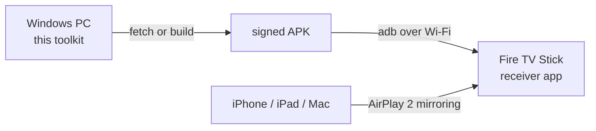

# firetv-airplay-toolkit

**Turn an Amazon Fire TV Stick into a working AirPlay 2 receiver from a Windows PC.**

[](https://github.com/MrkrampfKampf/firetv-airplay-toolkit/actions/workflows/lint.yml)
[](LICENSE)
[](#requirements)
[](https://github.com/jqssun/android-airplay-server)
[](#requirements)

Screen mirroring, video and audio from an iPhone, iPad or Mac to a Fire TV Stick,
with no Apple TV and no paid app. Two commands from a clean Windows machine to a
running receiver.

> [!IMPORTANT]
> **This repository is build and deployment automation, not an AirPlay
> implementation.** The receiver itself is
> [jqssun/android-airplay-server](https://github.com/jqssun/android-airplay-server),
> which builds on [UxPlay](https://github.com/FDH2/UxPlay). Both are GPL-3.0 and
> written by other people. What is mine here are the PowerShell scripts, the
> device-compatibility research and the documentation.



## Why this exists

Fire TV has no AirPlay support. The store apps that add it are either paid or
time-limited, and the free open-source receivers are Linux-first or still beta.

AirPlay mirroring cannot simply be reimplemented. The sending device demands a
FairPlay handshake whose keys come out of Apple TV firmware. UxPlay is the one
mature free implementation, written in C. The upstream project wraps it in an
Android app through JNI, which is why it genuinely works and why building it
needs the Android NDK.

Getting from that source tree to an APK on a Fire TV involves a JDK, the Android
SDK, an exact NDK version, CMake, four native submodules, a signing key and ADB
over the network. This toolkit does all of it.

## Requirements

* Windows 10 or 11 with PowerShell 5.1, plus Git
* A Fire TV Stick running Fire OS 6 or newer, see [compatibility](#device-compatibility)
* Fire TV and Apple device on the **same subnet**, no guest network, AP isolation off
* ADB debugging enabled under `Settings` then `My Fire TV` then `Developer Options`
* The stick's IP address from `Settings` then `My Fire TV` then `About` then `Network`
* For building from source, roughly 12 GB of free disk space

## Device compatibility

Three things decide it. The API level, because the app needs 24 or higher. The
CPU architecture. And whether the device runs Android at all.

| Model | Identifier | Fire OS | API | ABI | Works |
|---|---|---|---|---|:-:|
| Fire TV Stick HD, 2024 | AFTSS | 7, Android 9 | 28 | armeabi-v7a | yes |
| Fire TV Stick Lite / 3rd gen, 2020 | AFTSSS / AFTKA | 7, Android 9 | 28 | armeabi-v7a | yes |
| Fire TV Stick 4K, 2018 | AFTMM | 6, Android 7.1 | 25 | armeabi-v7a | yes |
| Fire TV Stick 4K Max | AFTKMST12 | 7 or 8 | 28 / 30 | arm64-v8a | yes |
| Fire TV Cube, 2nd and 3rd gen | AFTR / AFTGAZL | 7 or 8 | 28 / 30 | arm64-v8a | yes |
| Fire TV Stick 1st gen, 2014 | AFTM | 5, Android 5.1 | 22 | armeabi-v7a | no, below API 24 |
| Fire TV Stick 2nd gen, 2016 | AFTT | 5, Android 5.1 | 22 | armeabi-v7a | no, below API 24 |
| Fire TV Stick 4K Select, 2025 | AFTCA002 | **Vega OS** | none | none | no, runs no APKs |

The 2025 Fire TV Stick 4K Select is worth calling out. It moved to Amazon's Vega
OS, which is not Android and executes no APKs at all. No sideloading route exists
for it.

**Verified working:** Fire TV Stick HD 2024, Fire OS 7, armeabi-v7a. Mirroring
from an iPhone worked on the first attempt.

Ask the device itself if you are unsure:

```powershell
adb shell getprop ro.product.model
adb shell getprop ro.build.version.sdk
adb shell getprop ro.product.cpu.abi
```

## Quick start

Clone with submodules, fetch the upstream release APK, push it to the stick.

```powershell
git clone --recursive https://github.com/MrkrampfKampf/firetv-airplay-toolkit.git
```

```powershell
cd firetv-airplay-toolkit
```

```powershell
.\scripts\00a-get-adb.ps1
```

```powershell
.\scripts\00-get-prebuilt-apk.ps1
```

```powershell
.\scripts\03-sideload-firetv.ps1 -FireTvIp 192.168.1.42
```

That APK is the upstream maintainer's own signed release, identical to the F-Droid
build, and it carries all three ABIs so it runs on any supported generation. The
script verifies its SHA-256 against the digest the GitHub API reports for the asset.

## Building from source

Use this when you want your own signing key, or a build you can audit end to end.

```powershell
.\scripts\01-setup-toolchain.ps1 -AcceptSdkLicenses
```

```powershell
.\scripts\02-build-apk.ps1 -Abis armeabi-v7a
```

```powershell
.\scripts\03-sideload-firetv.ps1 -FireTvIp 192.168.1.42
```

The toolchain lands under `D:\android-toolchain` by default, chosen so a small
system drive stays untouched. Override it with `-ToolchainRoot`. The Gradle cache
goes there too.

| | |
|---|---|
| Downloads | about 3 GB, being JDK 21, Android SDK, NDK 27 and CMake |
| Disk footprint | about 12 GB |
| First build | 30 to 120 minutes, mostly FFmpeg and OpenSSL |
| Later builds | minutes |

The `-AcceptSdkLicenses` switch exists on purpose. Installing the Android SDK
means accepting [Google's SDK terms](https://developer.android.com/studio/terms),
and that acceptance should be yours rather than a side effect of running a script.

`-Abis` defaults to `arm64-v8a,armeabi-v7a`. There is no x86 Fire TV, so that
build is skipped. Naming a single ABI roughly halves the native build.

The first release build generates a signing key under `keystore\` and records it
in the submodule's `local.properties`. Keep both. Android only allows in-place
updates when the signature matches, so losing the key means uninstalling before
you can update.

## Scripts

| Script | Purpose |
|---|---|
| `00-get-prebuilt-apk.ps1` | Fetch the upstream signed release APK and verify its digest |
| `00a-get-adb.ps1` | Install Android platform-tools only, about 8 MB |
| `01-setup-toolchain.ps1` | JDK 21, Android SDK, NDK 27 and CMake into one directory |
| `02-build-apk.ps1` | Submodules, signing key, Gradle build, collect the APK |
| `03-sideload-firetv.ps1` | Connect over ADB, report the device, install, launch |

Every script is idempotent. Re-running reuses cached downloads, an existing
signing key and an already-patched build file.

## Using it

Start the app on the Fire TV. On the Apple device open Control Center, choose
Screen Mirroring, then pick the receiver. The app registers a Leanback launcher
entry, so it also appears on the Fire TV home screen under your apps.

## Limitations

* **DRM content will not play.** Netflix, Disney+ and the Apple TV app refuse to
  send a protected stream to anything that is not a real Apple TV. That is the
  sender's decision, not a gap in the build. No third-party receiver can change it.
* Mirroring adds latency. Fine for video and photos, poor for fast games.
* Entry-level sticks have 1 GB of RAM and decode 1080p60 with little headroom. If
  the picture stutters, lower the resolution or frame rate in the app's settings.

## Troubleshooting

| Symptom | Cause |
|---|---|
| Receiver never appears on the iPhone | different subnet, guest network, or AP isolation blocking mDNS |
| `adb devices` shows `unauthorized` | confirm the dialog on the television with the remote |
| `adb devices` shows `offline` | restart the stick from `Settings` then `My Fire TV` then `Restart` |
| Install fails on signatures | already installed with another key, run `adb uninstall io.github.jqssun.airplay` |
| `INSTALL_FAILED_OLDER_SDK` | a Fire OS 5 device at API 22, below the app's minimum |
| Picture stutters | lower the resolution or frame rate in the app |

Read the receiver's log live:

```powershell
adb logcat -s AirPlay:V *:S
```

## Credits

* [UxPlay](https://github.com/FDH2/UxPlay) by FDH2 and contributors, the AirPlay and RAOP implementation
* [android-airplay-server](https://github.com/jqssun/android-airplay-server) by jqssun, the Android app and JNI bridge
* [FFmpeg](https://ffmpeg.org) for lossless audio decoding
* Device facts from [Amazon's Fire TV device specifications](https://developer.amazon.com/docs/device-specs/device-specifications-fire-tv-streaming-media-player.html)

## License

GPL-3.0, matching the upstream projects this toolkit builds. See [LICENSE](LICENSE).

The `airplay-server` submodule is upstream's code under its own copyright. It is
not redistributed here, only referenced at a pinned commit, and nothing in this
repository ships a binary. If you distribute an APK you built with this toolkit,
GPL-3.0 requires you to make the corresponding source available.

---

Not affiliated with Apple Inc. or Amazon.com, Inc. AirPlay is a trademark of
Apple Inc. Fire TV is a trademark of Amazon.com, Inc.
